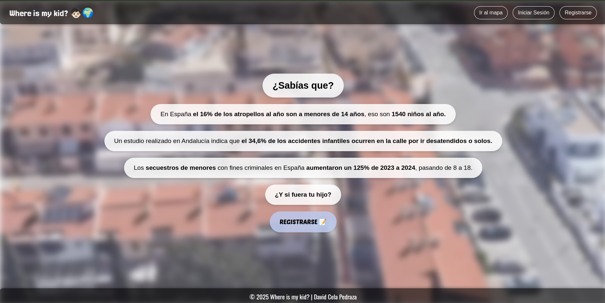
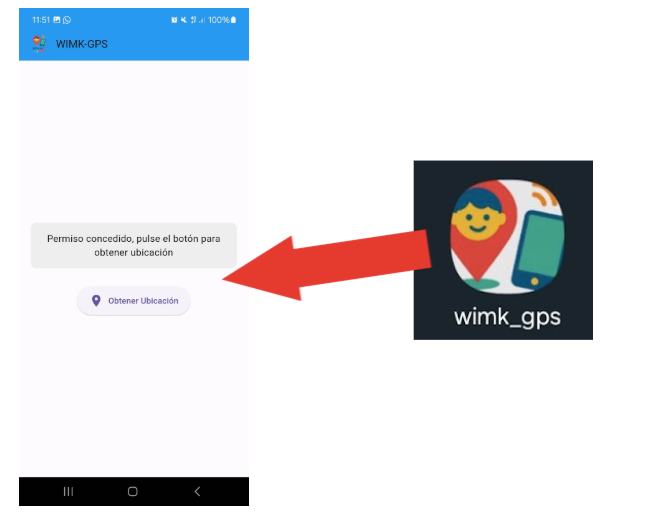
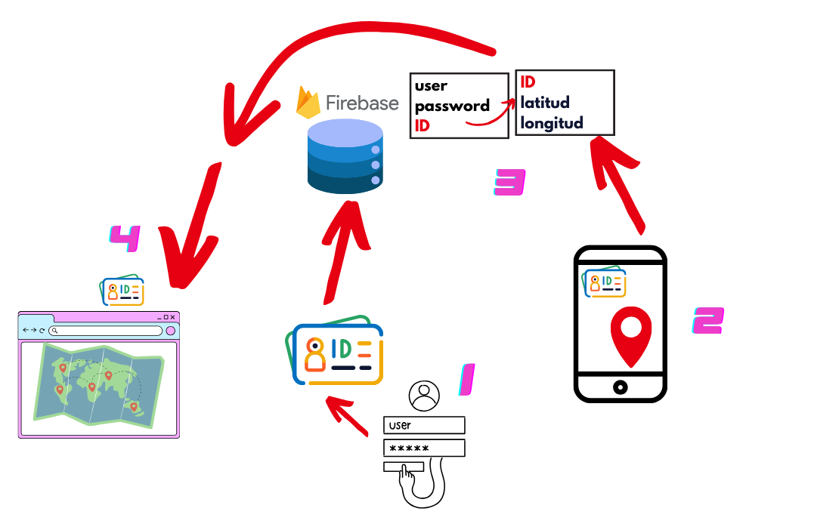

# Where is my kid? - Real-Time GPS Tracking System 🌍


## Final Degree Project - Network Systems Administration (ASIR)

**Author**: David Cela Pedraza  
**Date**: 2025

## 📋 Description

"Where is my kid? 🧒🏻🌍" is a real-time GPS tracking system 📍 designed as a Final Degree Project for the Network Systems Administration (ASIR) course. 
This project provides a solution that allows parents or legal tutors to monitor their children's location in real-time through a modern web interface 🌐 and a mobile application 📱 :)

## ✨ Features

- 🔄 **Real-time tracking**: Continuous device location updates
- 🔒 **Authentication system**: Secure access via email and password
- 📱 **Cross-platform mobile app**: Developed with Flutter for Android
- 🌐 **Modern web interface**: Built with Vue.js and Tailwind CSS
- 🧩 **Model-View-Presenter**: Clean architecture for better maintainability
- 🗺️ **Interactive map visualization**: Using Leaflet for geographic representation
- ☁️ **Cloud storage**: Firebase Firestore for data management
- 🔑 **Unique ID system**: Secure association between devices and accounts

## 🧩 System Components

The project consists of two main components:

### 1. Web Application 💻



The web interface allows users to:
- Register and log in to the system 
- Check the current location of the linked device in real-time

**Technologies used**:
- **Vue.js 3**: Modern reactive framework
- **Tailwind CSS**: Utility-first CSS framework
- **Vite**: Next-generation frontend tooling
- **Leaflet.js**: Interactive maps
- **Firebase Authentication**: User management
- **Firebase Firestore**: Real-time database
- **MVP Pattern**: Clean architecture separation

### 2. Mobile Application (WIMK-GPS) 📲



The mobile application (developed with Flutter) offers:
- Real-time location sending
- Device ID configuration
- Simple and easy-to-use interface

**Technologies used**:
- Flutter framework for cross-platform development
- Geolocator for location services
- Firebase SDK for database communication
- Shared Preferences for local storage of settings

## 🏗️ System Architecture



## 🚀 Setup and Installation

### Prerequisites 📝
- Node.js 16+
- npm or yarn
- Firebase account
- Flutter SDK (for mobile app)
- Git

### Web Application Installation 🖥️

The web application is deployed in production, but if you want to run it locally:
cd Realtime-GPS_Flutter_Firebase_Leaflet.js/wimk_gps

# Get dependencies
flutter pub get

# Run the application in debug mode
flutter run

# To generate installation APK
flutter build apk
```

## 🔐 Security Considerations

The system implements several security measures:

- Firebase-based authentication with **verified email**
- Encrypted data transmission via **HTTPS**
- **Unique ID system** to link devices and accounts
- Secure credential storage
- **Clean code practices** for security maintainability

## 📂 Project Structure (Web)

The web application follows the Model-View-Presenter (MVP) pattern:

```
Website/
├── firebase.js          # Centralized Firebase configuration
├── public/              # Static assets
├── src/
│   ├── assets/          # CSS, images, etc.
│   ├── components/      # Reusable Vue components
│   ├── models/          # Data models
│   ├── presenters/      # Presentation logic
│   ├── services/        # API and business services
│   ├── stores/          # State management
│   ├── views/           # Main page components
│   ├── App.vue          # Main app component
│   ├── main.js          # Application entry point
│   └── router/          # Vue Router configuration
└── package.json         # Dependencies
```

## ✅ Improvements in Version 2.0

- ✓ Migrated from vanilla JS to **Vue.js**
- ✓ Implemented **Tailwind CSS** for modern styling
- ✓ Restructured with **MVP pattern** for better maintainability
- ✓ Centralized **Firebase configuration**
- ✓ Eliminated hardcoded values and redundancies
- ✓ Improved state management
- ✓ Enhanced responsive design

## 👨‍💻 Author

This project was created and is maintained by David Cela Pedraza.

---

© 2025 David Cela Pedraza 🐰 

 